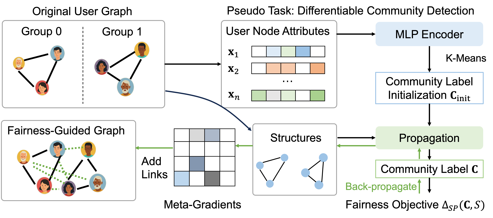

<<<<<<< HEAD
# FairGuide

A PyTorch implementation of "Let’s Grow an Unbiased Community : Guiding the Fairness of Graphs via New Links" 


<div align=center></div>

## Requirements

```
torch==2.5.0
pyg=2.6.1
```


## Dataset
 Pokec_z and Pokec_n are in [`dataset\pokec`] while Github is in [`dataset\github`].

## Usage

To Guide the original graph structure into fairer version, use:

```
python FG.py --dataset github
```

for testing the classification task, use:

```
python classification.py --dataset github --FG 1
```
for testing the Community Detection task, use:

```
python Community_detection.py --dataset github --FG 1
```


## Results Example for Github:
 
Classification before FairGuide:

```
Delta_{SP}: 0.11739799286772146
Delta_{EO}: 0.08267239199601073
F1: 0.7886206505723676
AUC: 0.8543455142164279
```

Classification after FairGuide:

```
Delta_{SP}: 0.08166063813245444
Delta_{EO}: 0.05482067229015519
F1: 0.7787179784397821
AUC: 0.8437302220959636
```

Community Detection before FairGuide:

```
Delta_SP: 0.3631
```

Community Detection after FairGuide:

```
Delta_SP: 0.2612
```


=======
# FairGuide
>>>>>>> 027ebdc39fd5abcefb1e6b24d3a9d2ba4ea47be7
